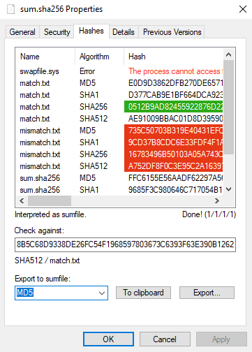

# OpenHashTab

## About

OpenHashTab is a shell extension for conveniently calculating and checking file hashes from file properties.

## Features

* MD5, SHA1, SHA-256 and SHA-512 support
* md5sum / sha1sum / sha256sum / sha512sum compatibility for checking and exporting hashes
* Easy to use checker and single-click export to clipboard or file
* High performance hash calculation
* Native Windows looks
* Long path support\*
* Multilingual: English, German, Italian, Hungarian, Simplified Chinese, Spanish, Danish

\* On Windows 8 or later, to the extent Windows supports it.

## Download

[Latest release](https://github.com/namazso/OpenHashTab/releases/latest/download/OpenHashTab_setup.exe)

## Screenshot

## Donations

This software is provided completely free of charge to you, however I spent time and effort developing it. If you like this software, please consider making a donation:

* Bitcoin: 1N6UzYgzn3sLV33hB2iS3FvYLzD1G4CuS2
* Monero: 83sJ6GoeKf1U47vD9Tk6y2MEKJKxPJkECG3Ms7yzVGeiBYg2uYhBAUAZKNDH8VnAPGhwhZeqBnofDPgw9PiVtTgk95k53Rd

## Building

### Requirements

* Visual Studio 2019
* [InnoSetup](http://www.jrsoftware.org/isinfo.php)

### Compiling

1. Open OpenHashTab.sln and click __Build Solution__ on x64/Release and Win32/Release settings
2. Use Inno Setup Compiler to compile installer.iss to get the installer

## Translation

Look into OpenHashTab/OpenHashTab.rc, figuring out what to translate should be trivial. If you have enough development knowledge send a PR, otherwise post an Issue. Thanks for making OpenHashTab better.

### Translation contributors

**xprism** (Simplified Chinese), **Niccolò Zanichelli** (Italian), **[@vmcall](https://github.com/vmcall/)** (Danish)

## License

All files are licensed under the following license, unless explicitly stated otherwise in the file:

	Copyright 2019 namazso <admin@namazso.eu>
	OpenHashTab - File hashing shell extension
	
	OpenHashTab is free software: you can redistribute it and/or modify
	it under the terms of the GNU General Public License as published by
	the Free Software Foundation, either version 3 of the License, or
	(at your option) any later version.
	
	OpenHashTab is distributed in the hope that it will be useful,
	but WITHOUT ANY WARRANTY; without even the implied warranty of
	MERCHANTABILITY or FITNESS FOR A PARTICULAR PURPOSE.  See the
	GNU General Public License for more details.
	
	You should have received a copy of the GNU General Public License
	along with OpenHashTab.  If not, see <https://www.gnu.org/licenses/>.