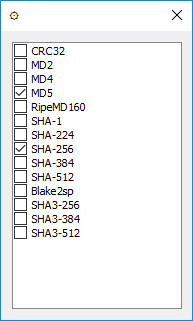

# OpenHashTab

## About

OpenHashTab is a shell extension for conveniently calculating and checking file hashes from file properties.

## Features

* Support for 14 different selectable algorithms, see **Algorithms**
* md5sum / sha1sum / sha256sum / etc.. compatibility for checking and exporting hashes
* Easy to use checker and single-click sumfile export to clipboard or file
* Select then 
* High performance hash calculation
* Native Windows looks
* Long path support\*
* Multilingual: English, German, Italian, Hungarian, Simplified Chinese, Spanish, Danish, Russian

\* On Windows 8 or later, to the extent Windows supports it.

## System requirements

* Windows Vista or later (x86 / x64 / ARM64)
* 1 GB RAM or more (for efficent hashing of more than 512 files at a time)

## Usage

Most of the actions should be obvious. Some not-so-obvious features are listed here:

* You can select multiple files or folders, all files will be hashed.
* Double click hash to copy it
* Double click name or algorithm to copy the line in sumfile format
* Select one or more lines then right click to copy all columns of the lines, separated by tabs
* Double right click to copy everything, separated by tabs
* The counters next to the status text is in the format `(match/mismatch/nothing to check against/error)`
* Selecting the tab on a sumfile will interpret it as such and hash the files listed in it.
* If a hashed file has a sumfile with same filename plus one of the [recognized sumfile extensions](https://github.com/namazso/OpenHashTab/blob/master/OpenHashTab/Hasher.cpp#L242-L251), the file hash is checked against it.

## Algorithms

* CRC32
* MD2, MD4, MD5
* RipeMD160
* Blake2sp
* SHA-1
* SHA-2 (SHA-224, SHA-256, SHA-384, SHA-512)
* SHA-3 (SHA3-256, SHA3-384, SHA3-512)
* BLAKE3

## Download

[Latest release](https://github.com/namazso/OpenHashTab/releases/latest/download/OpenHashTab_setup.exe)

[Development builds](https://github.com/namazso/OpenHashTab/actions)

## Screenshot

 

## Donations

This software is provided completely free of charge to you, however I spent time and effort developing it. If you like this software, please consider making a donation:

* Bitcoin: 1N6UzYgzn3sLV33hB2iS3FvYLzD1G4CuS2
* Monero: 83sJ6GoeKf1U47vD9Tk6y2MEKJKxPJkECG3Ms7yzVGeiBYg2uYhBAUAZKNDH8VnAPGhwhZeqBnofDPgw9PiVtTgk95k53Rd

## Building

### Requirements

* Visual Studio 2019 16.8+ (with ARM64 and clang-cl)
* [InnoSetup](http://www.jrsoftware.org/isinfo.php)

### Compiling

1. Build OpenHashTab.sln for x86, x64, ARM64
2. Use Inno Setup Compiler to compile installer.iss to get the installer

## Translation

Translate the project at [Weblate](https://hosted.weblate.org/projects/openhashtab/main/)

### Pre-weblate ranslation contributors

**xprism**, **[@NieLnchn](https://github.com/NieLnchn)** (Simplified Chinese), **Niccolò Zanichelli** (Italian), **[@vmcall](https://github.com/vmcall/)** (Danish), **[@wvxwxvw](https://github.com/wvxwxvw/)** (Russian), **[@Janaue](https://github.com/Janaue)** (French)

## Relationship to HashTab

HashTab is a similar purpose proprietary software. While this software has been inspired by it, I was never an user of HashTab and this software contains no code or anything related to it.

## License

All files are licensed under the following license, unless explicitly stated otherwise in the file:

	Copyright 2019-2020 namazso <admin@namazso.eu>
	OpenHashTab - File hashing shell extension
	
	OpenHashTab is free software: you can redistribute it and/or modify
	it under the terms of the GNU General Public License as published by
	the Free Software Foundation, either version 3 of the License, or
	(at your option) any later version.
	
	OpenHashTab is distributed in the hope that it will be useful,
	but WITHOUT ANY WARRANTY; without even the implied warranty of
	MERCHANTABILITY or FITNESS FOR A PARTICULAR PURPOSE.  See the
	GNU General Public License for more details.
	
	You should have received a copy of the GNU General Public License
	along with OpenHashTab.  If not, see <https://www.gnu.org/licenses/>.
